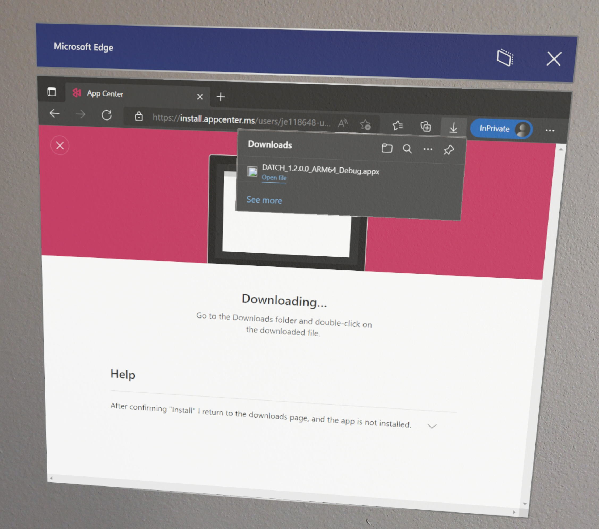

# DATCH Deployment Directions

> ## Summary
> Before deploying DATCH to the HoloLens 2, the application must be downloaded and installed through [Visual Studio App Center](https://appcenter.ms/apps).
> 
> There are two ways to download an app from Visual Studio App Center:
> 1. Email link <mark style="background: #BBFABBA6;">**<u>(Recommended)</u>**</mark>
> 2. Directly through Visual Studio App Center <mark style="background: #FF5582A6;">**<u>(Requires App Center login email)</u></mark>**
>
> *Both methods require that the user be included on the app distributor's email list.*

## Downloading the Most Recent DATCH Build
### Method 1: Email Link Download
If the user is on the DATCH releases email distribution list, the app can be downloaded through a link. When a new release is available, the user will receive an email with a link to the build file.

<b>1. In the HoloLens 2 main menu, open the Microsoft Edge web browser.</b>

 

<b>2. Navigate to the email website from which the app release email was sent.</b>

 

<b>3. Open the email and click "Install". Login to App Center and click the download link.</b>

<b>4. The app should begin downloading. After the download is complete, click "Open file" and follow any directions prompted on the screen to complete the installation process.</b>

<b>5. After the app installs, go back to the HoloLens main menu.</b>

	Steps:
	- Hold palm up, facing the headset
	- Click the Windows logo that appears on the wrist

<b>6. On the HoloLens menu, click "All Apps"</b>

<b>7. Find DATCH in the listed apps and click to open</b>

---
### Method 2: Visual Studio App Center Download
To access the most recent app build using this method, the user can directly access the builds list by logging into Visual Studio App Center. The user may still receive email notifications for new releases, but there is no need to navigate to the download through the link provided in the email.

<b>1. In HoloLens: Open main menu.</b>

<b>2. Open Microsoft Edge app.</b>

<b>3. Navigate to the [Visual Studio App Center website](https://appcenter.ms/apps) and log in.</b>

<b>4. A webpage showing the latest release should be displayed under "My Apps".

</b>

<b>5. Click the app to navigate to a download link (in Microsoft Edge, the link will open as a QR code). Click "DOWNLOAD"</b>

<b>6. The app should begin downloading, and a downloaded file will appear in the dropdown menu at the upper-right section of the webpage.</b>

<b>7. After the download is complete, click "Open file" and follow any directions prompted on the screen to complete the installation process.</b>

<b>8. After the app installs, go back to the HoloLens main menu.</b>

	
	Steps:
	- Hold palm up, facing the headset
	- Click the Windows logo that appears on the wrist

<b>9. On the HoloLens menu, click "All Apps"</b>

<b>10. Find DATCH in the listed apps and click to open</b>

## FAQ

<b>What if the app doesn't open after downloading?</b>
- Solution 1: Completely close all instances of the app, then reopen
	- Open the HoloLens main menu 
		- Hold palm up, facing the headset
		- Click the Windows logo that appears on the wrist
		- A rectangular "Home" button should be visible near the bottom of the HoloLens 2 main menu
		- Click the "Home" button
		- Floating panels should appear in space surrounding the user. 
		- Close each window by pressing the 'x' in the upper-right corner.
		- Reopen DATCH from the main menu
- Solution 2: Uninstall the app, then reinstall 
	- Open the HoloLens main menu 
		- Hold palm up, facing the headset
		- Click the Windows logo that appears on the wrist
	- Click "All Apps"
	- Locate DATCH in the list of apps
	- Press and hold  the app until additional options appear
	- Click "Uninstall"
	- Download and reinstall DATCH, as explained in the [directions for downloading the most recent build](#downloading-the-most-recent-datch-build).

<b>What if the app doesn't seem to have changed after downloading the most recent build?</b>
- Solution: Download and reinstall DATCH, as explained in the [directions for downloading the most recent build](#downloading-the-most-recent-datch-build).

<b>The download page is not available.</b>
- Solution: Ensure that the user is logged into Visual Studio App Center with the account listed on the app distributor's email list

