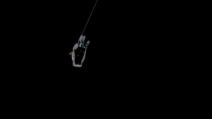
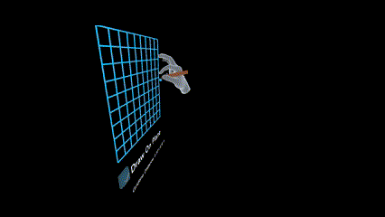
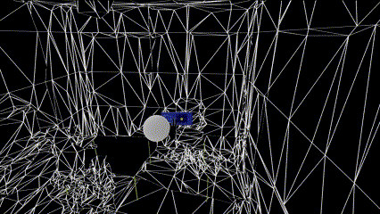
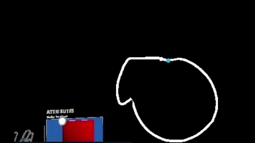
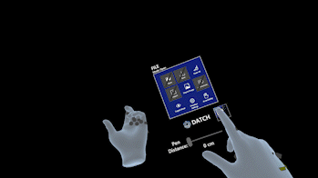
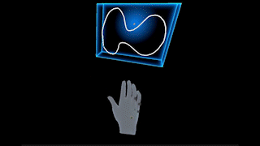
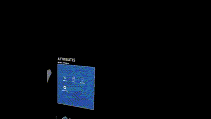
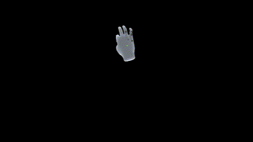

> ## Summary
> Below is a list of  all available features in the most updated version of DATCH.

### TOOLS:
#### **Free Draw**
Enables unrestricted freehand drawing
 
	
	**Steps for use:** 
	1. Select the “Free Draw” button from the Tools menu 
	2. Pinch and drag in midair to draw

> **Note**
> *If the start point of a line is brought near the end point, the ends will connect, closing the shape.*

#### **Line**
Enables drawing using line-connected points
 
	
	**Steps for use:**
	1. Select the “Line” button from the Tools menu 
	2. Point and pinch in midair to create a grab point
	3. Point and air pinch again to create an additional grab point, which will connect to the previous with a straight line
	4. Pinch and drag any of the grab points to reposition them 

> **Note**
> *If a grab point is brought near another grab point at the end of the line, a new line will bridge the gap between them, closing the shape.*

#### **Curve**
Enables drawing using floating splines
 

	**Steps for use:** 
	1. Select the “Curve” button from the Tools menu 
	2. A curve with 4 yellow grab points should appear in view 
	3. Pinch and drag any of the grab points to reshape the curve 
	4. Curves can be connected if one grab point is brought near another 

> **Note**
> *To disconnect grab points, swiftly drag a grab point from one direction to another.*

#### **Drawing Plane**
Display a 2D grid in front of user for drawing on flat surfaces
 
 
	
	**Steps for use:** 
	1. Tap the “Drawing Plane” button to create a drawing plane
	2. Aim near the surface of the drawing plane, pinch, and drag to draw along its surface
> **Note**
> *The plane can be automatically rotated perpendicular or parallel to the  ground using the respective buttons underneath the plane.*

#### **Undo**
Undo previous action 
	**Steps for use:** 
	1. Tap “Undo” button immediately after unwanted action is performed

#### **Delete**
Delete selected shape (highlighted by a blue box)
	**Steps for use:** 
	1. Hover over a shape to select it (the shape will be highlighted in blue when selected)
	2. Tap the "Delete" button

#### **Peg Markers**
Create a grid of marker pegs 

 

	**Steps for use:** 
	1. Tap the peg markers button
	2. Choose grid dimensions and spacing using arrow buttons and sliders 
	3. Tap the rotate buttons and pinch and drag the miniature (top-down view) peg grid in the Attributes menu to affect the placement of the larger grid
	4. Touch a peg to mark it for future reference

#### **Fill**
Fill a closed shape with a color 

 

	**Steps for use:** 
	1. Select a shape by pinching one of its points 
	2. Tap the “Fill” button to fill selected shape with current fill color

#### **Measuring Tools**
##### Measuring Cube
Generate a tool for measuring 3D shapes and structures

 

	**Steps for use:** 
	1. Tap the "Measuring Tools" button
	2. Tap the "Measuring Cube" button
	3. Resize and manipulate the measuring cube by pinching its handles; move it by grabbing and dragging it from the center

> **Note**
> *Multiple measuring cubes can be created and deleted.*

##### Measuring Tape
Generate a tool for measuring 2D shapes and distances (multiple measuring tapes can be created)

 

	**Steps for use:** 
	1. Tap the "Measuring Tools" button
	2. Tap the "Measuring Tape" button
	3. Change the length of the measuring tape by pinching one of its endpoints; move it by grabbing and dragging it from the center

### FILE:
#### **Clear All**
Erase all drawings in the scene 
	**Steps for use:** 
	1. Tap the “Clear All” button

#### **Log to Text File**
Add a timestamp to a log file for future reference

 

	**Steps for use:** 
	1. Tap the “Log to Text File” button
	2. Select the folder in which the log file should be saved in the internal storage of the HoloLens
	3. After use, connect the HoloLens 2 to a PC and locate the log file inside the previously-selected folder

#### **Import Image**
Import an image into the scene from HoloLens 2 internal storage 

> **Note**
> *Images must be saved to the internal storage of the HoloLens before using this feature.*

 

	**Steps for use:** 
	1. Tap the "Import Image" button
	2. Tap the folder containing any previously saved images
	3. Select an image and tap open
	4. The image will appear directly in front of the user
		- The image can be manipulated (moved, rotated, scaled) similarly to a shape
		- Change the image opacity using the opacity slider
		- Remove the background of the image by clicking the "Hide Background" checkbox under the opacity slider

#### **Toggle Mesh**
 

Show a wireframe outline of the environment (wireframe or pulse mesh)
	
	**Steps for use:** 
	1. Click the “Toggle Mesh” button to turn the wireframe environment mesh on and off

#### **Precision Settings**
##### Shape Rotation Snapping
 

Allow shapes to rotate by a set increment for more precise rotation
	
	**Steps for use:**
	1. Tap the "Precision Settings" button
	2. Tap the "Rotation Snapping" checkbox to enable rotation snapping
	3. Select an increment at which to rotate all shapes (10, 15, or 45 degrees)
	4. While rotation snapping is enabled, shapes will snap to rotate by the selected increment

##### **Precision Settings: Drawing Plane Gridpoint Snapping**
Allow lines on drawing plane to snap to the grid's intersection points for more precise drawings

 

	**Steps for use:**
	1. Tap the "Precision Settings" button
	2. Tap the "Drawing Plane Gridpoint Snapping" checkbox to enable rotation snapping
	3. While gridpoint snapping is enabled, drawings will snap to the intersection points of the drawing plane

#### **Accessibility**
##### Handedness
Change the menu for left-handed or right-handed use 

 

	**Steps for use:** 
	1. Tap the “Handedness” button

##### Theme
Change color palette of application for easier viewing 

 

	**Steps for use:** 
	1. Tap the “Theme” button in the File menu 
	2. Select preferred theme in Attributes menu

#### **Manually Close Shape**
Connect the endpoints of the selected shape (if unclosed) and fill it with a color

> **Note**
> *This feature reduces the additional steps of creating a shape, closing it, and filling it manually.*

 

	**Steps for use:** 
	1. Select an unclosed shape
	2. Tap the "Close Shape" button

#### **Link Points**
Connect the points on different shapes

 

	**Steps for use:
	1. Select a shape
	2. Grab a point contained within a selected shape
	3. Bring a point on the selected shape near a point on another shape

#### **Voice Commands**
- **Pin Menu**: Displays main menu that follows the user’s view 

> **Note**
> *This action can also be achieved by pressing the Pin button (DATCH logo).*

- **Hide Menu**: Closes main menu

- **Take a Picture**: Take a screenshot of current view 
> **Note**
> *This feature will later be available through the Screenshot button, which is currently disabled. A screenshot can also be taken by pressing the two buttons on the right-hand side of the headset. These pictures will save directly to the HoloLens 2.*

- **Switch Hand**: Change the menu to left-handed or right-handed use (Handedness)
> **Note**
> *Right handed use (menu constrained to left palm) is default.*

- **Toggle Mesh**: Toggle the wireframe mesh or pulse mesh

- **Undo**: Undo previous action

