# DATCH Features List

> ## Summary
> Details on all available features in the most updated version of DATCH.
>
>
> Sections:
>
> [Main Menu](#main-menu)
>
> [Drawing Modes](#drawing-modes)
>
> [Tools and Settings](#tools-and-settings)
>
> [Voice Commands](#voice-commands)
>
> [Menu Buttons Quick Reference](#menu-buttons-quick-reference)

## Main Menu
  

### Primary Buttons

 

- This section of the menu is comprised of two semicircles made up of buttons.
	- Inner Semicircle - Drawing mode buttons
	- Outer Semicircle - Tools and Settings buttons

### Attributes Panel

 

- Displays additional settings for the drawing mode or tool that is currently in use. 
- Panel Dock
	- Hide the Attributes Panel by tapping the dock button.
	- Undock the Attributes Panel by grabbing it and dragging it away from the dock.
	- Dock the Attributes Panel by grabbing it and placing it near the dock button (panel will snap back into place).

### Pin Menu
- Pins the menu in space in front of the user 

### Pen Distance Slider
- Changes the length of the pen tip for drawing along the surfaces of objects and structures that should not be disturbed

### Pen
- A pen appears in hand while pinching to visually indicate when the user is drawing.

  
## Drawing Modes 
 

### Free Draw
- Draw unrestricted freehand shapes

	 
		
		Steps:
		1. Tap the Free Draw button
		2. Pinch and drag in midair to draw
		
		Note: Close a shape by bringing the starting point (white) near the end point (blue).

### Line
- Draw polyagonal shapes by creating points connected by straight lines.

	 
		
		Steps:
		1. Tap the Line button
		2. Pinch in midair to create a point, then pinch another area in space to create an additional connected point
		3. Pinch and drag any of the grab points to reposition them 
		
		Note: Close the shape by bringing a point near another point.

### Curve
- Draw curved shapes using floating splines

	 

		Steps:
		1. Tap the Curve button
		2. Pinch in midair to create a curve with 4 points
		3. Pinch and drag any of the points to reshape the curve 
		
		Note: Close the shape by bringing a point near another point.
  

### *Drawing Attributes Panel*
 

- ### Color Picker
	- Before drawing, drag finger along the color picker gradient or tap one of the color swatches to select a color for the next drawn line.
- ### Line Weight Slider
	- Drag the slider up or down to increase or decrease the width of the next drawn line.
- ### Close Shape
	- Automatically close a partially-drawn shape and fill it with a color

		 

			Steps:
			1. Select an unclosed shape
			2. Tap the "Close Shape" button

  
## Tools and Settings
### File
- Opens the File Attributes Panel

  

### *File Attributes Panel:*
- ### New
	- Create a new empty DATCH file with no drawings or tools present in the space

- ### Open
	- Open a previously created DATCH file

- ### Save
	- Save a DATCH file of the current space

- ### Accessibility
	- Opens the Accessibility menu, which includes settings for ease of use settings for the application
	- ### Handedness
		- Change the menu orientation for left-handed or right-handed use 
		
			 

	- ### Theme
		- Change color palette of application for easier viewing 
			
			 

				Steps: 
				1. Tap the Accessibility button
				2. Tap the Theme button in the Attributes panel
				2. Tap preferred theme
- ### Import Image
	- Import an image into the space from HoloLens 2 internal storage.
		- Manipulation: The image can be manipulated (moved, rotated, scaled) similarly to a shape
		- Opacity Slider: Make the image more or less translucent
		- Hide/Show Background Checkbox: Remove or display the background of the image

		 

			Steps: 
			1. Tap the Import Image button
			2. Navigate through folders and tap an image to select it 
			3. Tap Open to display the image in space	

- ### Toggle Mesh
	- Show the spatial mesh a wireframe outline of the environment calculated by the headset
	
		 

- ### Precision Settings
	- Opens Precision Attributes Panel

	- ### *Precision Attributes Panel:*
		- ### Rotation Snapping Checkbox
			- Toggle rotation snapping, which makes shapes and tools rotate by specific degree increments
			- Select a specific degree value (10, 15, or 45) by which shapes and tools should snap when rotating 

- ### Log
	- Add text to a log file (.txt) to be viewed later for future reference.

		 

			Steps: 
			1. Tap the Log button
			2. Select a save location for the log file (create a new log file or overwrite existing log file)
			3. Type text using the system keyboard, then close the keyboard
			4. After use, connect the HoloLens 2 to a PC and locate the log file inside the previously-selected folder

  

### Clear All
- Erase all shapes and tools in the space 

### Delete
- Delete selected shape (highlighted by a blue box)

### Undo
- Undo previous action 

### Fill
- Fill a closed shape with a color 

	 

		Steps:
		1. Select a shape by touching it or hovering over it
		2. Tap the Fill button to fill the selected shape with current fill color

### Drawing Plane
- Display a 2D grid in front of user for drawing on flat surfaces

- ### Drawing Plane Attributes Panel:
	- ### Draw On Plane Checkbox
		- Toggle on to draw on the surface of the drawing plane
		- Toggle off to activate drawing plane manipulation handles
	- ### GridPoint Snapping Checkbox	
		- Allow lines on drawing plane to snap to the grid's intersection points for more precise drawings

	 

		Steps:
		1. Tap the Gridpoint Snapping checkbox (ensure that the Draw on Plane checkbox is toggled on)
		2. Drawings will snap to the intersection points of the drawing plane

	- ### Perpendicular Button
		- Automatically rotate the drawing plane to be situated perpendicular to the ground
	- ### Parallel Button
		- Automatically rotate the drawing plane to be situated parallel to the ground

		 
		
			Steps:
			1. Tap the Drawing Plane button to create a drawing plane
			2. Aim near the surface of the drawing plane, pinch, and drag to draw along its surface

### Tag
- Leave a physical note at a specific location or on a drawing
	- Keyboard Button
		- Open a keyboard to change the text inside the tag 
	- Link/Unlink
		- Make the anchor point of the tag snap or detach from a shape it is currently touching
	- Delete
		- Delete tag from the space

	 

		Steps:
		1. Tap the "Tag" button
		2. Grab empty space near the tag to move the entire tag or position the label or anchor individually
		3. Tap the keyboard button to enter a short message on the tag

### Peg Grid
Create a grid of marker pegs with specific dimensions

 
 

	Steps:
	1. Tap the Peg Grid button
	2. Tap the up or down arrow buttons on either side of the Length or Width sections to enter the desired number of pegs on each row and column.
	3. Tap the '+' or '-' buttons on either side of the Peg Spacing section to adjust the distance between each peg within the selected dimensions. 
	4. Tap the Create button to generate a grid in space
	5. Edit the position and rotation of the peg grid using manipulation handles
	6. Touch a peg in the grid to mark it for future reference (indicated by a change in color)

### *Peg Grid Attributes Panel*
- ### Length Buttons
	- Tap either button to increase or decrease the length of the grid
- ### Width Buttons
	- Tap either button to increase or decrease the width of the grid
- ### Peg Spacing Buttons
	- Tap either button to set the distance between each peg in a grid
- ### Create Grid Button
	- When grid dimensions are set, create a grid in place of the preview grid

  

### Measuring Tools
- Open the Measuring Tools Attributes Panel
### *Measuring Tools Attributes Panel*
- ### Measuring Cube
	- Generate a tool for measuring 3D (height, width, depth) shapes and structures 
		 

			Steps:
			1. Tap the Measuring Cube button
			2. Resize and manipulate the measuring cube by pinching its handles; move it by grabbing and dragging it from its center
- ### Measuring Tape
	- Generate a tool for measuring 2D (height, width) shapes and distances
		 

			Steps: 
			1. Tap Measuring Tape button
			2. Change the length of the measuring tape by grabbing one of its endpoints; move it by grabbing and dragging it from its center

### GPS
- Open GPS Attributes Panel and activate GPS functionality if available (rover and base must be powered on)
 
 

### *GPS Attributes Panel*
- ### Map
	- Display a floating map panel that displays icons for the objects present in space
  

## Voice Commands
### Clear All
- Remove all shapes and tools from the space
### Pin Menu
- Pins the menu in space in front of the user  
### Unpin Menu
- Lock menu to palm
### Switch Hand 
- Change the menu to left-handed or right-handed use (right-handed use, with menu constrained to left palm, is default)
### Toggle Mesh
- Toggle the wireframe spatial mesh on or off
### Undo
- Undo a previous action 
### Call Menu
- Bring menu into view
### Take a Picture
- Take a screenshot of the current view
	- Button shortcut: Press the two buttons on the right-hand side of the HoloLens 2
	- Voice command: "Take a picture"

  

---

  

## Menu Buttons Quick Reference
| Button                  | Description |
| --------------------------- | ----------- | 
| Accessibility                 | Show attributes panel containing accessiblity settings        |
| Clear All                     | Remove all tools and drawings from current scene        |
| Close Shape                   | Automatically close and fill shape        |
| Communicate                  | (Disabled) Communicate with other DATCH users        |
| Create Peg Grid   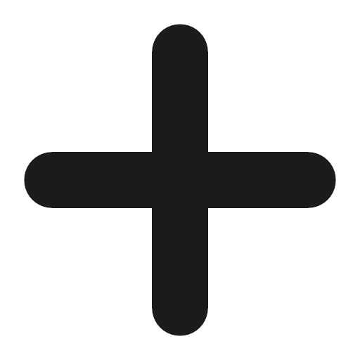             | Create a grid of marker pegs based on  selected settings       |
| Default Theme                | Set application color theme to default      |
| Delete                        | Delete selected shape or tool        |
| Dock                           | Dock, undock, and hide the attributes panel         |
| Drawing Plane                 | Create a surface for 2D drawing        |
| File   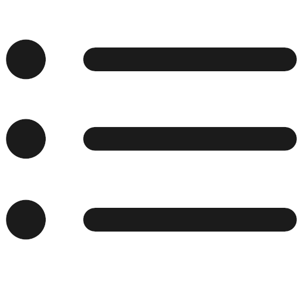                       | Open attributes panel for file settings        |
| Fill   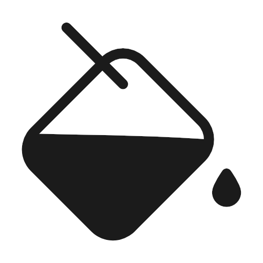                       | Fill selected shape with a color        |
| GPS                          | Show coordinates, altitude, and satellites in GPS attributes panel        |
| Handedness                    | Change dominant hand for application use        |
| Import Image   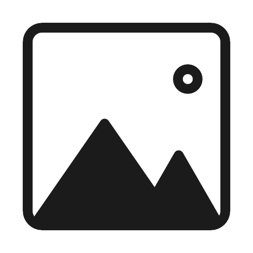                | Import an image saved on the headset        |
| Indoor Theme                   | Set application color theme to indoor        |
| Log                           | Add text to log file        |
| Map                           | Show map                    |
| Measuring Cube   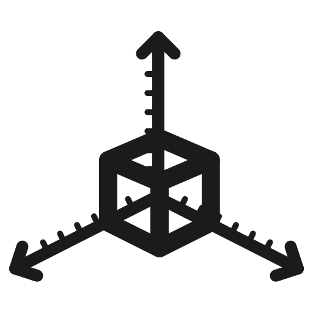             | Create a measuring cube for measuring in three dimensions        |
| Measuring Tape   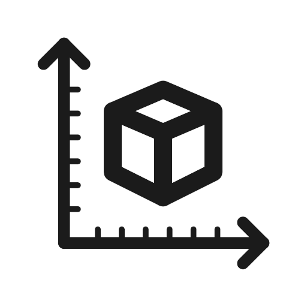             | Create measuring tape for measuring two dimensions      |
| Measuring Tools               | Open measuring tools panel        |
| New File   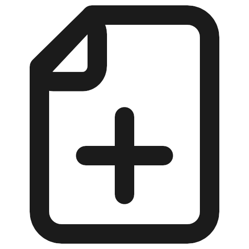                        | Open a blank, new file        |
| Open File                         | Open an existing file        |
| Outdoor Theme   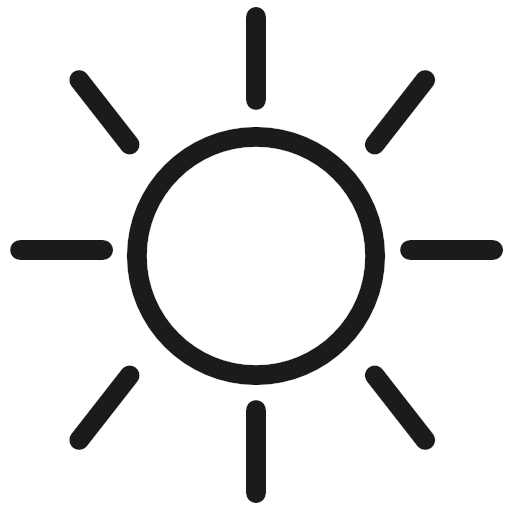              | Set application color theme to outdoor        |
| Parallel Drawing Plane   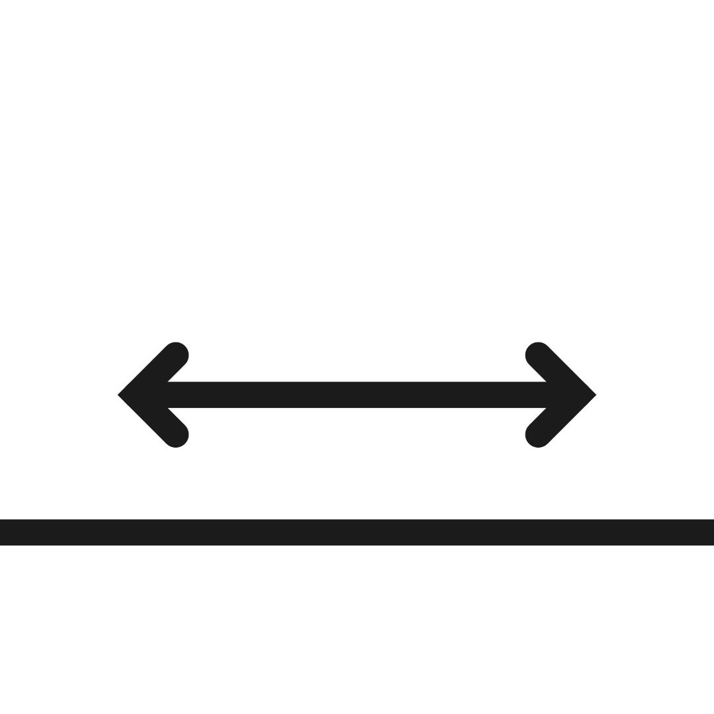     | Reposition drawing plane to be parallel to the floor        |
| Peg Grid                      | Open peg grid attributes panel        |
| Peg Grid Dimensions            | Set the dimensions of a peg grid        |
| Perpendicular Drawing Plane    | Reposition drawing plane to be perpendicular to the floor        |
| Pin Menu   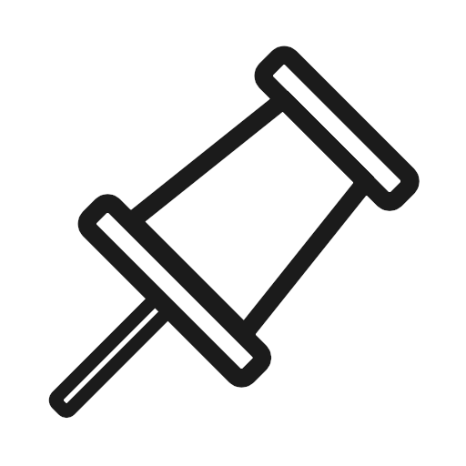                   | Pin the menu to a point in space        |
| Precision   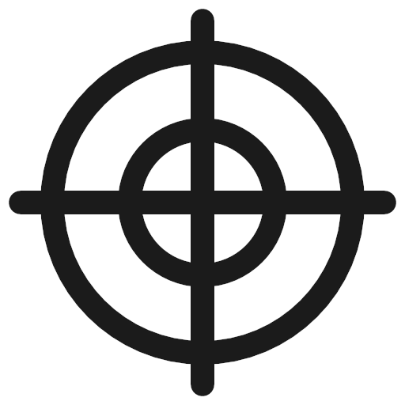                  | Open attributes panel for precision settings (e.g. rotation snapping)       |
| Save File                         | Save current file        |
| Tag                           | Create a tag for leaving a note in space        |
| Theme                         | Open attributes panel for application color theme settings        |
| Toggle Mesh   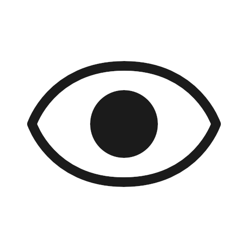                | Show/Hide the spatial mesh       |
| Undo                          | Undo last action performed on selected shape        |
