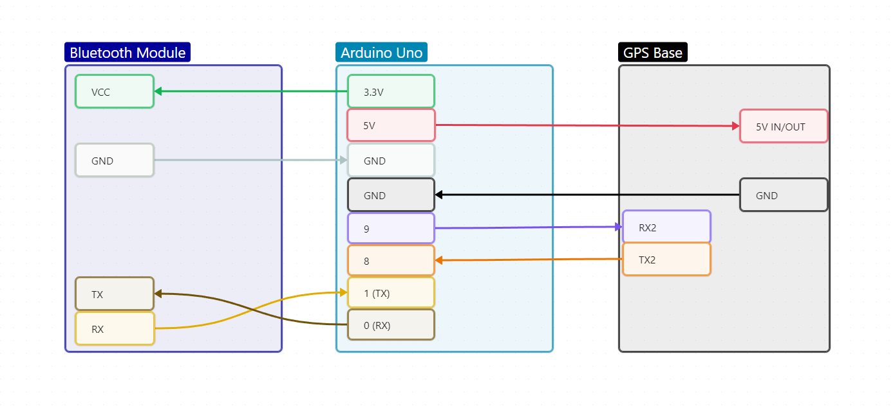

# Getting Started

> ## Summary
> The basic steps for getting started with using DATCH

## Open the Application

1. Go to the HoloLens main menu. 
	- Hold palm up, facing the headset
	- Click the Windows logo that appears on the wrist
2. On the HoloLens menu, click "All Apps"
3. Find DATCH in the listed apps and click to open.

## Basic Controls
1. The "Welcome to DATCH" and "Getting Started" text should display on screen.
2. Hold left hand up (facing the HoloLens) to display the main menu
> **Note**
> *By default, the application is oriented for right-handed users (left-hand-constrained menu), but the setting can be changed using the "Accessibility" button*

## General Use
### Pinch

- To perform a pinch, close the index finger and thumb of dominant hand, with the middle, ring, and pinky fingers held loosely outward (similar to when loosely gripping a pencil).

### Grab

- To perform a grab, close the index finger and thumb of dominant hand, with the middle, ring, and pinky fingers curled inward towards the palm.

### Selection

- Drawings can be selected by touching the drawing or hovering a hand near the drawing until a blue selection box appears around it.
	- Touch Selection: Touch a drawing or object to select
	- Hover Selection: Hover a hand near a drawing or tool for a few seconds (until the loading circle on the back of the hand fills)

### Manipulation

- Selected objects that can be manipulated (e.g. drawings, measuring cubes, image planes, etc.) include a blue selection box with handles. These handles can be grabbed and moved for precise movement, rotation, and scale controls.
- Selected objects can also be moved without constraint by grabbing empty space within the blue selection box and dragging.

### Link Points
- Points can be connected within the same shape or between different shapes.
- Connect Points
	- Bring a point on one shape near another point.
- Disconnect Points
	- Grab and swiftly flick a point from one direction to another.

## Additional Features
- For details on the full functionality of DATCH, see the [**DATCH Features List**](/DATCH%20Features%20List.md).

# FAQ
## What if the application freezes or stops working?
- ### Restart App
	Use this approach as the first course of action.

	1. Hold hand with palm in view
	2. Tap the Windows logo that appears on wrist
	3. After the system menu appears, tap the home icon towards the bottom of the menu
	4. Another window with the previous active app (DATCH) will appear in space; tap the "x" in the upper-right corner to close it

- ### Soft System Reset
	Use this approach if the method above does not work. 

	1. Hold hand with palm in view
	2. Tap the Windows logo that appears on wrist
	3. After the system menu appears, tap the user profile icon at the upper-center of the menu
	4. A drop-down will appear; click the restart button

- ### Hard System Reset
	Use this approach as the last resort.

	1. Hold the volume down and power buttons (right side of headset) for 15 seconds
	2. Wait for the headset to restart
	
## What if the GPS coordinates are not displaying in the GPS attributes panel?

- ### Power cycle the Base and Rover
	1. Turn off the power switch for the battery pack connected to the Rover
	2. Disconnect the Arduino Uno from its power source (unplug USB cable)
	3. After a few seconds, turn the power back on for the Rover and reconnect the power to the Base
	
- ### Check the wiring
	The wiring for the Base should match the setup shown below: 

